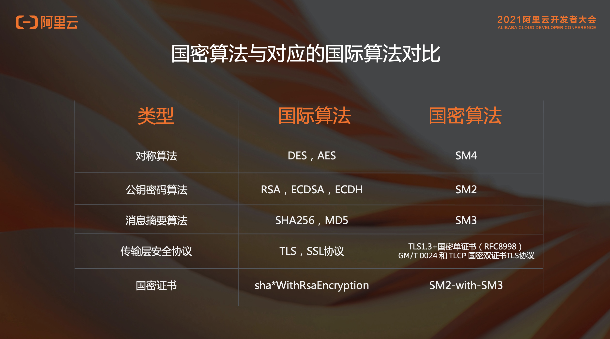

# 国密那些事

最近搞一个政府项目，遇到很多麻烦事，其中之一就是传输完整性校验和传输加密，而且还必须用国密来加密。在做这个项目之前，我都很少听过国密这个词，被折磨了一段时间之后，今天在这里做个总结。

首先是国密的定义：

> **国密是一个口语化的称呼，官方名称是国家商用密码**

其实我之前写过一个关于前端的密码学的一些小知识，其中就有一些对称加密、非对称加密的一些内容，在这里多了一个概念：消息摘要算法。这个算法主要是来检验完整性的。这里有一张对比图：

（图片来自网络，侵删）

国密算法主要是三种：SM2、SM3、SM4

SM2貌似最复杂，有很多种模式，不过我没用到，只简单介绍下他的概念：

> 它是基于椭圆曲线密码的公钥密码算法标准，其秘钥长度256bit，包含数字签名、密钥交换和公钥加密，用于替换RSA/DH/ECDSA/ECDH等国际算法。可以满足电子认证服务系统等应用需求，由国家密码管理局于2010年12月17号发布。
>
> SM2采用的是ECC 256位的一种，其安全强度比RSA 2048位高，且运算速度快于RSA。

主要说SM3和SM4。

SM3是一种密码杂凑算法：

> 用于替代MD5/SHA-1/SHA-2等国际算法，适用于数字签名和验证、消息认证码的生成与验证以及随机数的生成，可以满足电子认证服务系统等应用需求，于2010年12月17日发布。
>
> 它是在SHA-256基础上改进实现的一种算法，采用Merkle-Damgard结构，消息分组长度为512bit，输出的摘要值长度为256bit。

主要用于签名和完整性校验，我们的用法是——对于敏感信息，后端通过检验生成一个code，前端拿到后端数据之后也生成一个code，对比生成的code是否一样，如果一样那就是没问题，如果不一样就说明数据被篡改了，不给用户展示，并且提示用户环境问题。

SM4是分组加密算法：

> 我国自主设计的分组对称密码算法，用于替代DES/AES等国际算法。SM4算法与AES算法具有相同的密钥长度、分组长度，都是128bit。于2012年3月21日发布，适用于密码应用中使用分组密码的需求。

SM4是对称加密算法，就是有了key可以加密生成密文，也可以解密出原文来，不过有点不一样的是SM4有一个key（密钥），还有一个iv（Initialization Vector，初始化向量）。必须key和iv都相同的时候才能正确的加密和解密。
