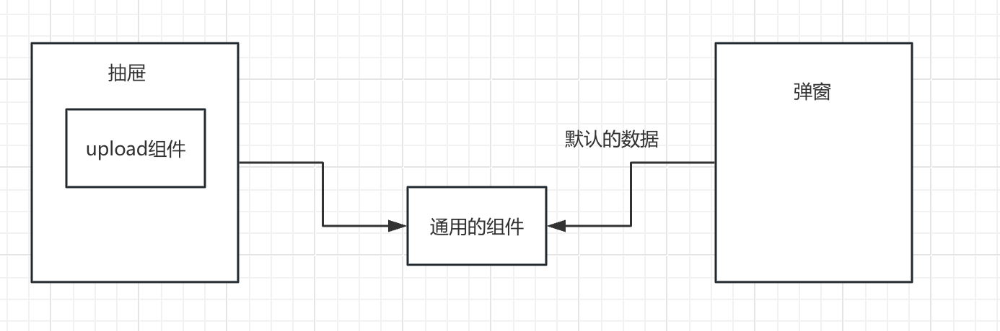
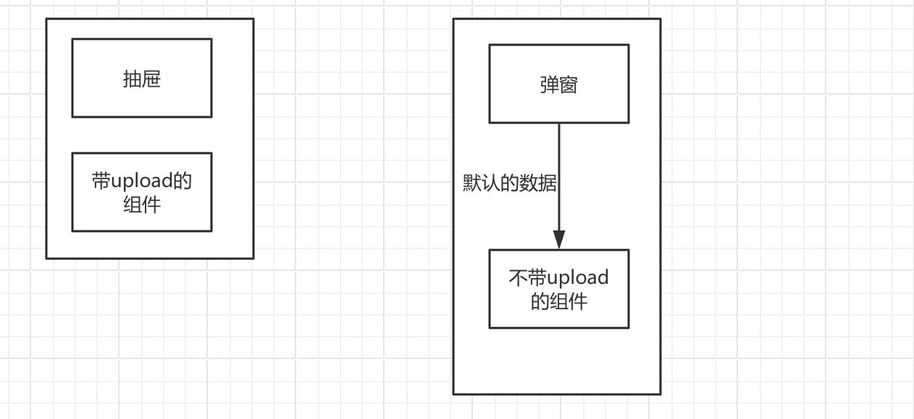

# 简单的问题不要复杂化

最近遇到两个在我看来应该很简单的问题，但是最后搞的非常复杂，所以今天就在这里总结一下。


首先是第一个，刨除业务逻辑大致是这样的： 



就是这样的一个父子组件的关系，这样其实非常的清晰，不管是把通用组件提取出来还是把upload组件放在通用组件里然后用参数去控制，这样简单很多，但是我看到的代码最后写成了这样：



关键是这两个组件还有一部分在同一个文件里，弹窗和抽屉又在不同的组件里，最后管理一团乱麻，我整理了一两个小时最后理顺了这里的关系，然后又花了将近一个小时把这里的代码整理成第一种的样子。

其实我理解，有时候怕动别人的代码导致一些意想不到的问题出现所以选择了CV大法然后在改改就搞成一个新的模块，然后去用，但是这样虽然一时爽了，导致的问题就是后续的维护很复杂，需要加功能的时候容易漏掉或者出问题，比如我就是因为这里有一些新的功能需要去实现，所以就看了一下这里的实现，发现问题很大，就把这里整理了一下，如果之前设计组件的时候就按照第一种方案其实我一个小时就把这个功能做完了，而不需要先把这里整理一遍了。当然我也可以图省力，把这里的逻辑写成一个组件，然后每个地方都去引用，严格来说我这里也没有把东西写成很多的逻辑，但是看到这样的设计让我没办法无视，并且为了严谨一些，我把这里的各个引用都看了，发现其实这个改动并没有非常耗费时间，所以就顺手做了，但是如果这里的逻辑非常复杂，我可能会增加很多的时间去搞，我可能也会选择暂时不整理这里，那么慢慢的这里就会成为一个历史的技术债问题。如果一个项目里到处都是这样的代码，可能每次改动都会产生不可预测的后果，那么这个项目也就接近尾声了，因为几乎无法维护了。虽然从辩证的角度来看，任何事物都有其消亡的时候，但是良好的架构可以延缓一个项目消亡的速度。

第二个问题和第一个有点类似：
 一个Edit组件，用于编辑用户信息，因为很多地方都可以编辑，所以就有挺多地方用到，但是又因为不同的地方方案都不太一样，所以有一些细微的差别，但是整体的逻辑是一致的，然后有一个让我不太理解的代码，大概是这样

 ```js
 if (xxxx) {
  editUserInfo()
  } else {
  propsConfirm()
 
 }
 ```


怎么说呢，让我看的很难受，confirm的时候如果区别太大，那么久都自己传进来事件，把主动权交给调用方，如果差距不大，那就做一些判断把这里的信息统一一下，至少从风格和代码的统一度上是很好的组织方式。

但是一查历史，好像也是一步步的变成这样的，好像每次加上的东西都是正常的，然后慢慢就进化成了这样的一个结果。导致这样结果的原因和第一个其实是一样的，就是只管当下的需求，然后慢慢的就会积累成这样的问题。

我是很喜欢开发过程中看到不爽的地方去重构的，当然也造成过几次线上的问题，但是这些地方不去改慢慢就会越来越多的问题出现。

—— 2026.01.08